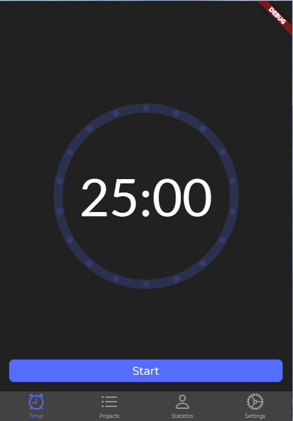
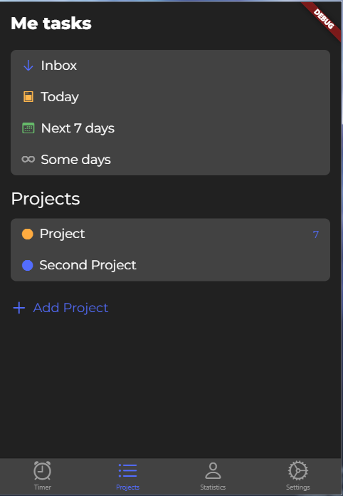
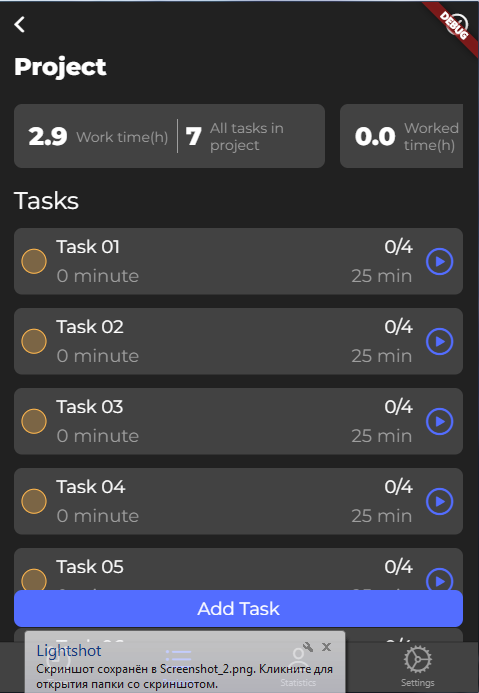
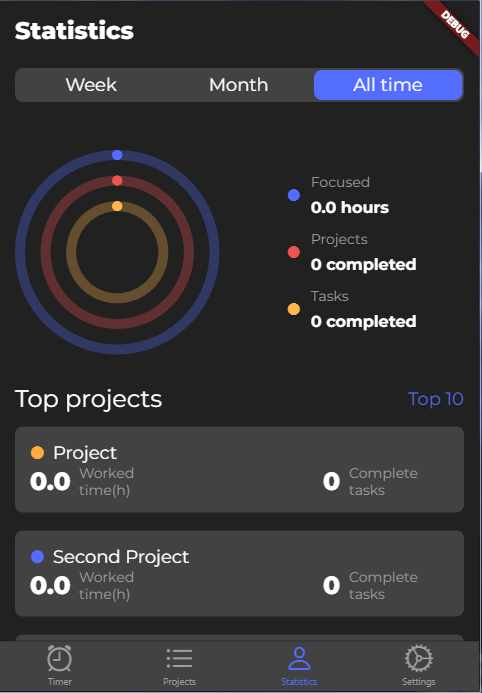
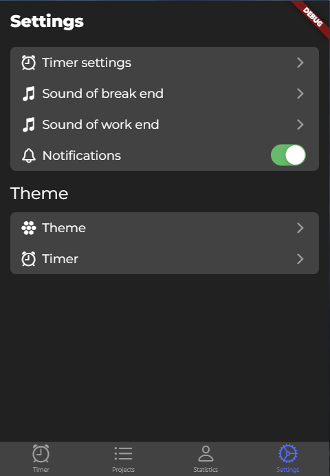
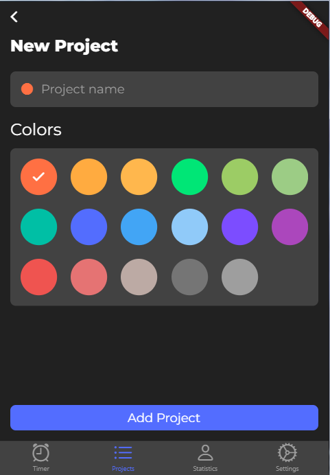
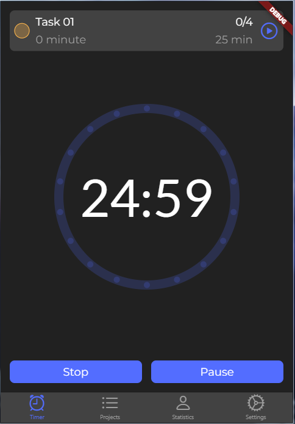
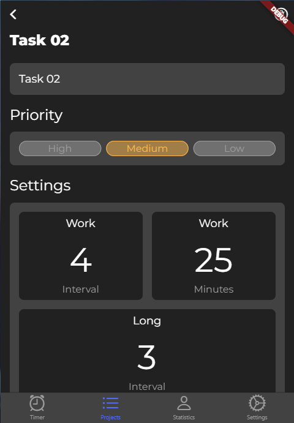
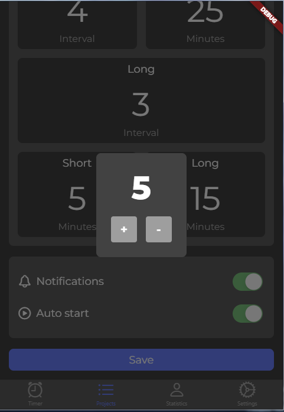

# Pomodoro timer - time management

App assists you in organizing your tasks and accomplishing them efficiently with the help of the Pomodoro Technique timer.

- [Design](https://dribbble.com/shots/11897384-Pomodoro-Timer-App?utm_source=Clipboard_Shot&utm_campaign=Novaslide&utm_content=Pomodoro%20Timer%20App&utm_medium=Social_Share&utm_source=Clipboard_Shot&utm_campaign=Novaslide&utm_content=Pomodoro%20Timer%20App&utm_medium=Social_Share)

## Screenshots

<table>
  <tr>
    <td></td>
    <td></td>
    <td></td>
  </tr>
  <tr>
    <td></td>
    <td></td>
    <td></td>
  </tr>
  <tr>
    <td></td>
    <td></td>
    <td></td>
  </tr>
 </table>

## Used packages:
- [Flutter bloc](https://pub.dev/packages/flutter_bloc)
- [Hive](https://pub.dev/packages/hive)
- [Flutter hive](https://pub.dev/packages/hive_flutter)
- [Syncfusion flutter gauges](https://pub.dev/packages/syncfusion_flutter_gauges)
- [Just audio](https://pub.dev/packages/just_audio)
- [Flutter local notifications](https://pub.dev/packages/flutter_local_notifications)

## Getting Started

This project is a starting point for a Flutter application.

A few resources to get you started if this is your first Flutter project:

- [Lab: Write your first Flutter app](https://flutter.dev/docs/get-started/codelab)
- [Cookbook: Useful Flutter samples](https://flutter.dev/docs/cookbook)

For help getting started with Flutter, view our
[online documentation](https://flutter.dev/docs), which offers tutorials,
samples, guidance on mobile development, and a full API reference.
